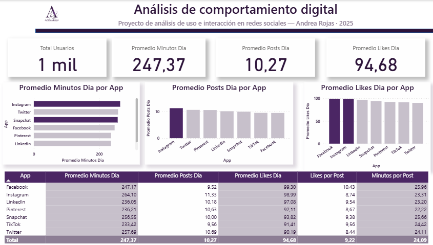

---

## 📊 Análisis y visualización (Power BI)

**🎯 Introducción:**  
Este proyecto analiza los patrones de uso e interacción en redes sociales mediante un enfoque de Business Intelligence, utilizando Excel para la exploración y Power BI para la visualización y construcción de KPIs.

**🎯 Objetivo visual:**  
Mostrar de forma clara y atractiva los patrones de uso, actividad e interacción en redes sociales, a partir del análisis del dataset *Social Media Usage Dataset*.

**🧩 Herramientas utilizadas:**  
- Excel → Exploración y limpieza inicial de datos.  
- Power BI → Creación del modelo, medidas DAX y dashboard interactivo.

📂 **Dataset:** [Social Media Usage Dataset (Kaggle)](https://www.kaggle.com/datasets/bhadramohit/social-media-usage-datasetapplications)
El dataset es sintético pero útil para fines educativos y de práctica analítica.

---

### 📈 Principales visualizaciones
- **KPIs principales:** total de usuarios, promedio de minutos, publicaciones y likes por día.  
- **Gráficos comparativos:** barras horizontales y verticales para analizar minutos, posts y likes por aplicación.  
- **Tabla resumen:** métricas combinadas de tiempo, actividad e interacción para cada red social.

---

### 💡 Conclusiones visuales
- Las plataformas con **mayor tiempo promedio de uso** son **Instagram** y **Twitter**.  
- **Snapchat** y **LinkedIn** presentan **mayor frecuencia de publicaciones**.  
- La **interacción medida por “likes por día”** se mantiene equilibrada entre plataformas, con ligera ventaja de **Instagram** y **LinkedIn**.  

Estas observaciones reflejan un comportamiento digital diverso, donde las redes visuales y profesionales concentran la mayor participación diaria.

### 🧩 Nota sobre el concepto de *engagement*

En este análisis, el **engagement** se entiende como el nivel de interacción de los usuarios con cada plataforma.  
Para medirlo, se combinaron tres indicadores presentes en el dataset:

- **Likes por día**
- **Publicaciones diarias**
- **Tiempo promedio de uso**

> Esta combinación permite identificar qué redes generan una participación más activa, no solo en términos de permanencia, sino también de interacción y actividad del usuario.

### 🎓 Qué aprendí en este proyecto

Este proyecto me permitió fortalecer habilidades fundamentales para mi desarrollo en Análisis de Datos y Business Intelligence:

- **Exploración y limpieza de datos** utilizando Excel para identificar patrones, valores faltantes y duplicados.
- **Pensamiento analítico**, transformando datos en conclusiones claras, útiles y accionables.
- **Creación de medidas DAX** en Power BI para construir KPIs relevantes y comparables.
- **Diseño de dashboards** aplicando criterios de estética, jerarquía visual y consistencia con una identidad de marca personal.
- **Interpretación del engagement**, evaluando interacción, actividad y tiempo de uso a través de métricas integradas.
- **Documentación profesional**, estructurando el proceso completo como un caso de estudio transparente y fácil de seguir.
- **Comunicación de hallazgos**, redactando insights que explican los comportamientos observados y sus posibles implicaciones.

Este primer proyecto consolidó mi enfoque hacia el BI y reafirmó mi interés en comunicar datos de forma clara, visual y orientada a la toma de decisiones.

---

📁 **Archivo Power BI:** [Descargar](./analisis_comportamiento_digital_andrea_rojas.pbix)

> 🪶 *Dashboard creado por Andrea Rojas — 2025.*
