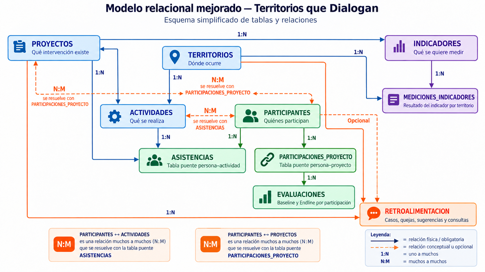

# Modelo de datos

## Propósito del modelo

La base de datos de **Territorios que Dialogan** representa el sistema de información de un programa ficticio de construcción de paz comunitaria.

El modelo está orientado a **MEAL (Monitoring, Evaluation, Accountability and Learning)** y permite relacionar información sobre:

- proyectos;
- territorios;
- actividades;
- participantes;
- participación en proyectos;
- asistencia y exposición a actividades;
- evaluaciones Baseline–Endline;
- indicadores y mediciones;
- retroalimentación comunitaria.

Todos los datos utilizados en el proyecto son ficticios y se generan exclusivamente con fines educativos y de portafolio.

---

## Principios de diseño

El modelo se construyó siguiendo cinco principios:

1. **Granularidad clara:** cada tabla debe responder qué representa exactamente una fila.
2. **Normalización:** la información no se repite innecesariamente entre tablas.
3. **Integridad referencial:** las claves foráneas conectan registros válidos entre tablas.
4. **Separación entre datos almacenados y resultados calculados:** porcentajes, tasas y agregados se calculan mediante SQL cuando pueden derivarse de los datos existentes.
5. **Minimización de datos personales:** los participantes se identifican mediante códigos ficticios y variables agrupadas.

---

## Tablas definitivas

El modelo está compuesto por **10 tablas**:

| N.º | Tabla | Granularidad |
|---:|---|---|
| 1 | `proyectos` | Una fila representa un proyecto |
| 2 | `territorios` | Una fila representa una comunidad o zona de intervención |
| 3 | `actividades` | Una fila representa una actividad concreta |
| 4 | `participantes` | Una fila representa una persona participante |
| 5 | `participaciones_proyecto` | Una fila representa la relación entre una persona y un proyecto |
| 6 | `asistencias` | Una fila representa la relación entre una persona y una actividad |
| 7 | `evaluaciones` | Una fila representa una medición Baseline o Endline de una participación |
| 8 | `indicadores` | Una fila representa un indicador vinculado a un proyecto |
| 9 | `mediciones_indicadores` | Una fila representa la medición de un indicador en un territorio y periodo |
| 10 | `retroalimentacion` | Una fila representa un caso de retroalimentación |

---

## Clasificación funcional

### Estructura del programa

- `proyectos`
- `territorios`

### Implementación

- `actividades`

### Participación

- `participantes`
- `participaciones_proyecto`
- `asistencias`

### Resultados y evaluación

- `evaluaciones`
- `indicadores`
- `mediciones_indicadores`

### Accountability

- `retroalimentacion`

---

## Relaciones generales

El modelo contiene dos relaciones muchos-a-muchos principales.

### Participantes y proyectos

Conceptualmente:

```text
PARTICIPANTES N:M PROYECTOS
```

La relación se resuelve mediante:

```text
PARTICIPANTES
      1
      │
      N
PARTICIPACIONES_PROYECTO
      N
      │
      1
PROYECTOS
```

### Participantes y actividades

Conceptualmente:

```text
PARTICIPANTES N:M ACTIVIDADES
```

La relación se resuelve mediante:

```text
PARTICIPANTES
      1
      │
      N
ASISTENCIAS
      N
      │
      1
ACTIVIDADES
```

### Evaluaciones

Las evaluaciones no se relacionan directamente con la persona.

La ruta correcta es:

```text
PARTICIPANTES
      ↓
PARTICIPACIONES_PROYECTO
      ↓
EVALUACIONES
```

Esto permite distinguir los resultados de una misma persona cuando participa en proyectos diferentes.

### Indicadores

```text
PROYECTOS
    ↓
INDICADORES
    ↓
MEDICIONES_INDICADORES
    ↑
TERRITORIOS
```

### Retroalimentación

Cada caso se vincula obligatoriamente con un proyecto y un territorio.

La relación con un participante es opcional porque un caso puede ser anónimo.

---

## Diagrama relacional

<p align="center">
  
</p>

---

# Tabla 1: `proyectos`

## ¿Qué representa?

La tabla `proyectos` almacena los cuatro componentes operativos del programa **Territorios que Dialogan**.

Los proyectos son:

| Código | Proyecto |
|---|---|
| P01 | Jóvenes Constructores de Convivencia |
| P02 | Mujeres Mediadoras Comunitarias |
| P03 | Redes Locales de Diálogo |
| P04 | Comunidades que Aprenden |

## Granularidad

```text
1 fila = 1 proyecto
```

Una fila no representa una actividad, una persona ni un territorio.

## Campos

| Campo | Tipo lógico | Descripción |
|---|---|---|
| `id_proyecto` | Identificador | Clave primaria interna |
| `codigo_proyecto` | Código | Código único del proyecto |
| `nombre_proyecto` | Texto | Nombre del proyecto |
| `objetivo_especifico` | Texto | Objetivo programático |
| `fecha_inicio` | Fecha | Inicio del proyecto |
| `fecha_fin` | Fecha | Finalización prevista |
| `presupuesto_aprobado` | Decimal | Presupuesto aprobado |
| `estado` | Texto | Estado del proyecto |

## Claves y restricciones

Clave primaria:

```text
id_proyecto
```

Código único:

```text
codigo_proyecto
```

Los códigos legibles, como `P01`, son especialmente útiles porque no dependen del valor interno generado mediante `AUTO_INCREMENT`.

## Relaciones

Un proyecto puede tener:

```text
1 proyecto → muchas actividades
1 proyecto → muchas participaciones_proyecto
1 proyecto → muchos indicadores
1 proyecto → muchos casos de retroalimentacion
```

Relaciones físicas:

```text
proyectos.id_proyecto
→ actividades.id_proyecto

proyectos.id_proyecto
→ participaciones_proyecto.id_proyecto

proyectos.id_proyecto
→ indicadores.id_proyecto

proyectos.id_proyecto
→ retroalimentacion.id_proyecto
```

## Información que no se almacena directamente

No se almacenan en esta tabla:

- número total de participantes;
- número de actividades;
- porcentaje de ejecución;
- cantidad de evaluaciones;
- cantidad de casos de retroalimentación.

Estos resultados se calculan mediante SQL.

## Idea clave

`proyectos` responde principalmente:

```text
¿Qué intervención se está gestionando?
```

---

# Tabla 2: `territorios`

## ¿Qué representa?

La tabla `territorios` almacena las comunidades o zonas donde se implementa el programa.

## Granularidad

```text
1 fila = 1 comunidad o zona de intervención
```

Dos comunidades situadas en un mismo municipio siguen siendo registros distintos.

## Campos

| Campo | Tipo lógico | Descripción |
|---|---|---|
| `id_territorio` | Identificador | Clave primaria interna |
| `departamento` | Texto | Departamento |
| `municipio` | Texto | Municipio |
| `comunidad` | Texto | Comunidad o zona específica |
| `zona` | Texto | Clasificación territorial |
| `nivel_prioridad` | Texto | Prioridad programática |

## Claves y restricciones

Clave primaria:

```text
id_territorio
```

Restricción única:

```text
UNIQUE (departamento, municipio, comunidad)
```

Esta combinación evita registrar dos veces la misma comunidad dentro del mismo municipio y departamento.

## Relaciones

```text
1 territorio → muchas actividades
1 territorio → muchos participantes
1 territorio → muchas mediciones_indicadores
1 territorio → muchos casos de retroalimentacion
```

Relaciones físicas:

```text
territorios.id_territorio
→ actividades.id_territorio

territorios.id_territorio
→ participantes.id_territorio

territorios.id_territorio
→ mediciones_indicadores.id_territorio

territorios.id_territorio
→ retroalimentacion.id_territorio
```

## Información que no se almacena directamente

No se almacenan:

- número de participantes;
- número de actividades;
- tasa de asistencia;
- cumplimiento de indicadores;
- número de casos de retroalimentación.

Todos pueden calcularse mediante consultas.

## Idea clave

`territorios` responde:

```text
¿Dónde ocurre la intervención?
```

---

# Tabla 3: `actividades`

## ¿Qué representa?

La tabla `actividades` almacena las acciones concretas realizadas o planificadas dentro de los proyectos.

Cada actividad pertenece a un proyecto y se asocia con un territorio.

## Granularidad

```text
1 fila = 1 actividad concreta
```

Dos actividades del mismo tipo realizadas en fechas distintas son registros diferentes.

## Campos

| Campo | Tipo lógico | Descripción |
|---|---|---|
| `id_actividad` | Identificador | Clave primaria |
| `codigo_actividad` | Código | Código único y legible |
| `id_proyecto` | Identificador | Proyecto al que pertenece |
| `id_territorio` | Identificador | Territorio asociado |
| `nombre_actividad` | Texto | Nombre específico |
| `tipo_actividad` | Texto | Categoría de actividad |
| `fecha_planificada` | Fecha | Fecha prevista |
| `fecha_realizacion` | Fecha / NULL | Fecha real |
| `modalidad` | Texto | Modalidad |
| `meta_participantes` | Entero | Meta prevista de participantes |
| `duracion_horas` | Decimal | Duración |
| `costo_planificado` | Decimal | Costo previsto |
| `costo_real` | Decimal / NULL | Costo real |
| `estado_actividad` | Texto | Estado de ejecución |

## Claves y restricciones

Clave primaria:

```text
id_actividad
```

Código único:

```text
codigo_actividad
```

Claves foráneas:

```text
id_proyecto
id_territorio
```

## Relaciones

```text
proyectos.id_proyecto
→ actividades.id_proyecto

territorios.id_territorio
→ actividades.id_territorio

actividades.id_actividad
→ asistencias.id_actividad
```

Por tanto:

```text
1 proyecto → muchas actividades
1 territorio → muchas actividades
1 actividad → muchos registros de asistencia
```

## Meta frente a participación real

`meta_participantes` representa una meta.

No representa necesariamente una capacidad máxima.

La participación real se obtiene desde `asistencias`.

```text
meta_participantes ≠ participación real
```

## Modalidad

En el dataset sintético actual se utilizan actividades:

```text
Presencial
Virtual
```

La modalidad forma parte de las reglas de elegibilidad utilizadas durante la generación de asistencias.

## Fechas y costos

Se diferencia entre:

```text
fecha_planificada
fecha_realizacion
```

y entre:

```text
costo_planificado
costo_real
```

Esto permite comparar planificación y ejecución.

## Información que no se almacena directamente

No se guardan:

- asistentes reales;
- tasa de asistencia;
- porcentaje de cumplimiento de la meta;
- costo por participante;
- distribución demográfica de asistentes.

Estos resultados se obtienen mediante SQL.

## Idea clave

`actividades` responde:

```text
¿Qué acción concreta se realizó o planificó?
```

---

# Tabla 4: `participantes`

## ¿Qué representa?

La tabla `participantes` almacena la información básica de las personas ficticias incluidas en el sistema.

## Granularidad

```text
1 fila = 1 persona participante
```

Una persona puede participar en varios proyectos y asistir a muchas actividades, pero solo aparece una vez en esta tabla.

## Campos

| Campo | Tipo lógico | Descripción |
|---|---|---|
| `id_participante` | Identificador | Clave primaria |
| `codigo_participante` | Código | Código único no nominal |
| `id_territorio` | Identificador | Territorio principal |
| `sexo` | Texto | Variable de desagregación |
| `rango_edad` | Texto | Rango de edad |
| `grupo_poblacional` | Texto | Grupo poblacional |
| `fecha_registro` | Fecha | Fecha de registro |

## Claves y restricciones

Clave primaria:

```text
id_participante
```

Código único:

```text
codigo_participante
```

Clave foránea:

```text
id_territorio
```

## Relación con territorios

```text
territorios.id_territorio
→ participantes.id_territorio
```

Un territorio puede tener muchas personas participantes.

## Participante no significa inscripción

`participantes` responde:

```text
¿Quién es la persona dentro del sistema?
```

No responde:

```text
¿En qué proyecto participa?
```

Eso corresponde a `participaciones_proyecto`.

## Estado de participación

La tabla `participantes` no contiene un campo `estado_participante`.

Esto es intencional.

Una misma persona puede tener estados diferentes según el proyecto.

Ejemplo:

```text
PAR-010 + P01 → Finalizada
PAR-010 + P04 → Retirada
```

El estado pertenece a `participaciones_proyecto`.

## Relación con actividades

La relación conceptual es:

```text
PARTICIPANTES N:M ACTIVIDADES
```

y se resuelve mediante `asistencias`.

## Privacidad y minimización

El modelo no almacena:

- nombres;
- documentos de identidad;
- teléfonos;
- correos personales;
- direcciones particulares;
- edades exactas.

Los participantes se identifican mediante códigos como:

```text
PAR-001
PAR-002
PAR-003
```

## Información que no se almacena directamente

No se guardan:

- número de proyectos por persona;
- número de actividades;
- horas acumuladas;
- tasa de asistencia;
- estado dentro de cada proyecto;
- cambio Baseline–Endline.

## Idea clave

```text
participantes
→ quién

participaciones_proyecto
→ en qué proyecto

asistencias
→ qué ocurrió en cada actividad

evaluaciones
→ cómo cambia dentro de una intervención
```

---

# Tabla 5: `participaciones_proyecto`

## ¿Qué representa?

La tabla `participaciones_proyecto` registra la relación entre una persona y un proyecto.

Es una tabla puente.

## Granularidad

```text
1 fila = 1 participante + 1 proyecto
```

Ejemplo:

```text
PAR-010 + P01
PAR-010 + P04
```

son dos participaciones diferentes de la misma persona.

## Campos

| Campo | Tipo lógico | Descripción |
|---|---|---|
| `id_participacion` | Identificador | Clave primaria |
| `id_participante` | Identificador | Persona participante |
| `id_proyecto` | Identificador | Proyecto |
| `fecha_inscripcion` | Fecha | Fecha de inscripción |
| `estado_participacion` | Texto | Estado dentro del proyecto |
| `fecha_salida` | Fecha / NULL | Fecha de salida |
| `motivo_salida` | Texto / NULL | Motivo de salida |

## Claves y restricciones

Clave primaria:

```text
id_participacion
```

Claves foráneas:

```text
id_participante
id_proyecto
```

Restricción única:

```text
UNIQUE (id_participante, id_proyecto)
```

Esto evita inscribir dos veces a la misma persona en el mismo proyecto.

## Relación muchos-a-muchos

Conceptualmente:

```text
PARTICIPANTES N:M PROYECTOS
```

Físicamente:

```text
PARTICIPANTES 1:N PARTICIPACIONES_PROYECTO
PROYECTOS     1:N PARTICIPACIONES_PROYECTO
```

## Información propia de la relación

La tabla puente no contiene únicamente claves.

También guarda atributos propios de la relación persona–proyecto:

```text
fecha_inscripcion
estado_participacion
fecha_salida
motivo_salida
```

Por eso la participación tiene significado analítico propio.

## Permanencia y salida

En el dataset actual las participaciones pueden terminar como:

```text
Finalizada
Retirada
```

Cuando existe una salida registrada, `fecha_salida` y `motivo_salida` permiten analizar permanencia y abandono.

## Relación con evaluaciones

```text
participaciones_proyecto.id_participacion
→ evaluaciones.id_participacion
```

Esta decisión evita mezclar los resultados de una misma persona cuando participa en proyectos distintos.

## Importancia longitudinal

Para comparar Baseline y Endline debe mantenerse constante:

```text
id_participacion
```

La comparación se realiza sobre la misma relación persona–proyecto.

## Diferencia frente a asistencias

```text
participaciones_proyecto
→ en qué proyecto está vinculada una persona

asistencias
→ qué ocurrió respecto a una actividad concreta
```

## Idea clave

La tabla puente convierte:

```text
PARTICIPANTES N:M PROYECTOS
```

en dos relaciones 1:N y, además, almacena información propia de la participación.

---

# Tabla 6: `asistencias`

## ¿Qué representa?

La tabla `asistencias` registra la relación entre una persona y una actividad concreta.

Es la segunda tabla puente principal del modelo.

## Granularidad

```text
1 fila = 1 participante + 1 actividad
```

## Campos

| Campo | Tipo lógico | Descripción |
|---|---|---|
| `id_asistencia` | Identificador | Clave primaria |
| `id_actividad` | Identificador | Actividad |
| `id_participante` | Identificador | Persona |
| `estado_asistencia` | Texto | Resultado de asistencia |
| `completo_actividad` | Booleano | Indica si completó la actividad |
| `horas_participacion` | Decimal | Horas realmente participadas |
| `fecha_registro` | Fecha | Fecha del registro |

## Claves y restricciones

Clave primaria:

```text
id_asistencia
```

Claves foráneas:

```text
id_actividad
id_participante
```

Restricción única:

```text
UNIQUE (id_actividad, id_participante)
```

Una persona puede participar en muchas actividades, pero no puede aparecer dos veces en la misma actividad.

## Relación muchos-a-muchos

Conceptualmente:

```text
PARTICIPANTES N:M ACTIVIDADES
```

Físicamente:

```text
PARTICIPANTES 1:N ASISTENCIAS
ACTIVIDADES    1:N ASISTENCIAS
```

## Estados de asistencia

El dataset actual utiliza:

```text
Presente
Ausente
Retiro temprano
```

### Presente

La persona participó.

Puede haber completado o no la actividad.

### Ausente

Regla de coherencia:

```text
estado_asistencia = Ausente
→ completo_actividad = FALSE
→ horas_participacion = 0
```

### Retiro temprano

Regla de coherencia:

```text
estado_asistencia = Retiro temprano
→ completo_actividad = FALSE
→ horas_participacion > 0
```

## Presencia y finalización no son iguales

Ejemplo:

| Estado | Completa | Interpretación |
|---|---|---|
| Presente | TRUE | Participó y completó |
| Presente | FALSE | Participó, pero no completó |
| Retiro temprano | FALSE | Participación parcial |
| Ausente | FALSE | No participó |

## Elegibilidad

La generación de asistencias considera:

- proyecto;
- territorio;
- modalidad;
- fecha de inscripción;
- fecha de salida;
- tipo de actividad;
- perfil de compromiso.

Una persona no puede aparecer en una actividad realizada antes de su inscripción ni después de su salida.

## Actividades CORE y abiertas

Durante la simulación se diferencia entre:

```text
CORE
ABIERTA
```

Las actividades CORE forman parte del itinerario principal utilizado para estudiar continuidad, exposición y seguimiento longitudinal.

Las actividades abiertas permiten una participación más flexible.

Esta clasificación es una regla del generador y no un campo almacenado directamente en la tabla `actividades`.

## Meta frente a participación real

La meta se encuentra en:

```text
actividades.meta_participantes
```

La participación real se deriva de `asistencias`.

En el análisis del proyecto, la participación real se considera a partir de registros cuyo estado no es `Ausente`.

## Información que no se almacena directamente

No se guardan:

- tasa de asistencia;
- porcentaje de exposición CORE;
- actividades completadas acumuladas;
- criterio final de completitud;
- nombre del participante;
- nombre del proyecto.

## Idea clave

`asistencias` responde:

```text
¿Qué ocurrió entre una persona y una actividad concreta?
```

---

# Tabla 7: `evaluaciones`

## ¿Qué representa?

La tabla `evaluaciones` almacena mediciones realizadas sobre una participación concreta dentro de un proyecto.

Los dos tipos principales son:

```text
Baseline
Endline
```

## Granularidad

```text
1 fila = 1 medición de 1 participación
```

Una misma participación puede tener como máximo una medición de cada tipo.

## Campos

| Campo | Tipo lógico | Descripción |
|---|---|---|
| `id_evaluacion` | Identificador | Clave primaria |
| `id_participacion` | Identificador | Participación evaluada |
| `tipo_medicion` | Texto | Baseline o Endline |
| `fecha_medicion` | Fecha | Fecha |
| `puntaje_conocimientos` | Entero | Puntaje |
| `puntaje_confianza` | Entero | Puntaje |
| `puntaje_convivencia` | Entero | Puntaje |
| `formulario_completo` | Booleano | Estado del formulario |

## Claves y restricciones

Clave primaria:

```text
id_evaluacion
```

Clave foránea:

```text
id_participacion
```

Restricción única:

```text
UNIQUE (id_participacion, tipo_medicion)
```

Esto impide registrar dos Baseline o dos Endline para la misma participación.

## Relación correcta

```text
PARTICIPANTES
      ↓
PARTICIPACIONES_PROYECTO
      ↓
EVALUACIONES
```

No existe una clave foránea directa desde `evaluaciones` hacia `participantes`.

## Baseline y Endline

`Baseline` representa la medición inicial.

`Endline` representa una medición posterior.

El cambio se calcula mediante SQL:

```text
Endline - Baseline
```

y puede analizarse para:

```text
puntaje_conocimientos
puntaje_confianza
puntaje_convivencia
```

## Cohorte longitudinal

El proyecto utiliza una cohorte longitudinal para estudiar a las mismas participaciones a lo largo del tiempo.

La cobertura de Endline es distinta del criterio de finalización del programa.

Son conceptos diferentes:

```text
cobertura Endline
≠
programa completado
```

## Información que no se almacena directamente

No se guarda:

- diferencia Baseline–Endline;
- porcentaje de mejora;
- promedio del proyecto;
- comparación territorial;
- clasificación de cambio.

Todos esos resultados se calculan mediante SQL.

## Idea clave

La unidad analítica longitudinal es:

```text
id_participacion
```

no simplemente `id_participante`.

---

# Tabla 8: `indicadores`

## ¿Qué representa?

La tabla `indicadores` contiene la definición de los indicadores utilizados para hacer seguimiento a los proyectos.

## Granularidad

```text
1 fila = 1 indicador
```

## Campos

| Campo | Tipo lógico | Descripción |
|---|---|---|
| `id_indicador` | Identificador | Clave primaria |
| `codigo_indicador` | Código | Código único |
| `id_proyecto` | Identificador | Proyecto |
| `nombre_indicador` | Texto | Nombre |
| `tipo_indicador` | Texto | Clasificación |
| `unidad_medida` | Texto | Unidad |
| `meta_total` | Decimal | Meta total |
| `frecuencia_medicion` | Texto | Frecuencia |
| `fuente_verificacion` | Texto | Fuente prevista |
| `desagregacion_requerida` | Texto / NULL | Desagregación |
| `estado_indicador` | Texto | Estado |

## Claves y restricciones

Clave primaria:

```text
id_indicador
```

Código único:

```text
codigo_indicador
```

Clave foránea:

```text
id_proyecto
```

## Relación con proyectos

```text
proyectos.id_proyecto
→ indicadores.id_proyecto
```

Un proyecto puede tener varios indicadores.

Cada indicador pertenece a un proyecto.

## Definición frente a resultado

`indicadores` almacena la definición y la meta.

No almacena cada resultado territorial o periódico.

Los resultados se guardan en:

```text
mediciones_indicadores
```

Por tanto:

```text
indicadores
→ qué se mide y cuál es la meta

mediciones_indicadores
→ cuánto se alcanzó en un territorio y periodo
```

## Información que no se almacena directamente

No se guarda:

- porcentaje de cumplimiento;
- brecha frente a meta;
- promedio territorial;
- tendencia temporal.

Estos resultados se calculan posteriormente.

## Idea clave

`indicadores` responde:

```text
¿Qué queremos medir?
```

---

# Tabla 9: `mediciones_indicadores`

## ¿Qué representa?

La tabla `mediciones_indicadores` almacena los valores alcanzados por los indicadores en territorios y periodos concretos.

## Granularidad

```text
1 fila = 1 indicador + 1 territorio + 1 periodo
```

## Campos

| Campo | Tipo lógico | Descripción |
|---|---|---|
| `id_medicion` | Identificador | Clave primaria |
| `id_indicador` | Identificador | Indicador |
| `id_territorio` | Identificador | Territorio |
| `periodo` | Texto | Periodo de medición |
| `fecha_medicion` | Fecha | Fecha |
| `valor_alcanzado` | Decimal | Resultado |
| `fuente_verificacion_registrada` | Texto | Fuente utilizada |
| `estado_validacion` | Texto | Estado de validación |
| `observaciones` | Texto / NULL | Observaciones |

## Claves y restricciones

Clave primaria:

```text
id_medicion
```

Claves foráneas:

```text
id_indicador
id_territorio
```

Restricción única:

```text
UNIQUE (id_indicador, id_territorio, periodo)
```

Esto evita registrar dos veces el mismo indicador para el mismo territorio y periodo.

## Relaciones

```text
indicadores.id_indicador
→ mediciones_indicadores.id_indicador

territorios.id_territorio
→ mediciones_indicadores.id_territorio
```

## Meta frente a resultado

La meta total se encuentra en:

```text
indicadores.meta_total
```

El valor observado se encuentra en:

```text
mediciones_indicadores.valor_alcanzado
```

La comparación se calcula mediante SQL.

## Información que no se almacena directamente

No se guardan:

- porcentaje de cumplimiento;
- brecha;
- variación entre periodos;
- ranking territorial;
- tendencia.

## Idea clave

```text
indicadores
= definición y meta

mediciones_indicadores
= resultado observado
```

---

# Tabla 10: `retroalimentacion`

## ¿Qué representa?

La tabla `retroalimentacion` almacena casos recibidos mediante los mecanismos de escucha y accountability del programa.

Los casos pueden representar, entre otros:

- consultas;
- sugerencias;
- quejas;
- reconocimientos;
- solicitudes.

## Granularidad

```text
1 fila = 1 caso de retroalimentación
```

## Campos

| Campo | Tipo lógico | Descripción |
|---|---|---|
| `id_retroalimentacion` | Identificador | Clave primaria |
| `codigo_caso` | Código | Código único |
| `id_proyecto` | Identificador | Proyecto relacionado |
| `id_territorio` | Identificador | Territorio |
| `id_participante` | Identificador / NULL | Participante, cuando aplica |
| `fecha_recepcion` | Fecha | Fecha de recepción |
| `canal_recepcion` | Texto | Canal |
| `tipo_retroalimentacion` | Texto | Tipo de caso |
| `categoria` | Texto | Categoría |
| `es_anonima` | Booleano | Indica anonimato |
| `nivel_prioridad` | Texto | Prioridad |
| `estado_caso` | Texto | Estado |
| `fecha_limite_respuesta` | Fecha | Plazo |
| `fecha_respuesta` | Fecha / NULL | Fecha real de respuesta |
| `satisfaccion_respuesta` | Entero / NULL | Satisfacción |
| `observaciones` | Texto / NULL | Observaciones |

## Claves y restricciones

Clave primaria:

```text
id_retroalimentacion
```

Código único:

```text
codigo_caso
```

Claves foráneas:

```text
id_proyecto
id_territorio
id_participante
```

`id_participante` puede ser `NULL`.

## Relaciones

```text
proyectos.id_proyecto
→ retroalimentacion.id_proyecto

territorios.id_territorio
→ retroalimentacion.id_territorio

participantes.id_participante
→ retroalimentacion.id_participante
```

## Regla de anonimato

Cuando:

```text
es_anonima = TRUE
```

el proyecto exige:

```text
id_participante = NULL
```

Esta regla se valida en el pipeline de generación y carga.

## Casos identificados

Cuando un caso no es anónimo, el participante debe ser compatible con el proyecto asociado.

Esta coherencia se controla durante la generación y prevalidación de los datos.

## Respuesta y satisfacción

`fecha_respuesta` puede ser `NULL` si el caso todavía no tiene respuesta registrada.

`satisfaccion_respuesta` también puede ser `NULL` cuando no existe una valoración.

## Información que no se almacena directamente

No se guardan:

- días de respuesta;
- porcentaje respondido dentro del plazo;
- tasa de satisfacción;
- distribución por categoría;
- porcentaje de casos anónimos.

Estos resultados se calculan mediante SQL.

## Idea clave

`retroalimentacion` representa la dimensión de **Accountability** del modelo:

```text
¿Qué comunica la comunidad al programa y cómo responde el programa?
```

---

# Resumen de claves primarias

| Tabla | Clave primaria |
|---|---|
| `proyectos` | `id_proyecto` |
| `territorios` | `id_territorio` |
| `actividades` | `id_actividad` |
| `participantes` | `id_participante` |
| `participaciones_proyecto` | `id_participacion` |
| `asistencias` | `id_asistencia` |
| `evaluaciones` | `id_evaluacion` |
| `indicadores` | `id_indicador` |
| `mediciones_indicadores` | `id_medicion` |
| `retroalimentacion` | `id_retroalimentacion` |

---

# Resumen de restricciones UNIQUE

| Tabla | Restricción |
|---|---|
| `proyectos` | `codigo_proyecto` |
| `territorios` | `(departamento, municipio, comunidad)` |
| `actividades` | `codigo_actividad` |
| `participantes` | `codigo_participante` |
| `participaciones_proyecto` | `(id_participante, id_proyecto)` |
| `asistencias` | `(id_actividad, id_participante)` |
| `evaluaciones` | `(id_participacion, tipo_medicion)` |
| `indicadores` | `codigo_indicador` |
| `mediciones_indicadores` | `(id_indicador, id_territorio, periodo)` |
| `retroalimentacion` | `codigo_caso` |

---

# Resumen de claves foráneas

```text
actividades.id_proyecto
→ proyectos.id_proyecto

actividades.id_territorio
→ territorios.id_territorio

participantes.id_territorio
→ territorios.id_territorio

participaciones_proyecto.id_participante
→ participantes.id_participante

participaciones_proyecto.id_proyecto
→ proyectos.id_proyecto

asistencias.id_actividad
→ actividades.id_actividad

asistencias.id_participante
→ participantes.id_participante

evaluaciones.id_participacion
→ participaciones_proyecto.id_participacion

indicadores.id_proyecto
→ proyectos.id_proyecto

mediciones_indicadores.id_indicador
→ indicadores.id_indicador

mediciones_indicadores.id_territorio
→ territorios.id_territorio

retroalimentacion.id_proyecto
→ proyectos.id_proyecto

retroalimentacion.id_territorio
→ territorios.id_territorio

retroalimentacion.id_participante
→ participantes.id_participante
```

---

# Relaciones muchos-a-muchos resueltas

## Participantes ↔ Proyectos

```text
PARTICIPANTES N:M PROYECTOS
        ↓
participaciones_proyecto
```

La tabla puente almacena además información propia de la relación:

- fecha de inscripción;
- estado;
- fecha de salida;
- motivo de salida.

## Participantes ↔ Actividades

```text
PARTICIPANTES N:M ACTIVIDADES
        ↓
asistencias
```

La tabla puente almacena además:

- estado de asistencia;
- completitud;
- horas de participación;
- fecha de registro.

---

# Diferencia entre las principales granularidades

```text
proyectos
1 fila = 1 intervención

territorios
1 fila = 1 comunidad

actividades
1 fila = 1 evento o acción

participantes
1 fila = 1 persona

participaciones_proyecto
1 fila = 1 persona + 1 proyecto

asistencias
1 fila = 1 persona + 1 actividad

evaluaciones
1 fila = 1 participación + 1 tipo de medición

indicadores
1 fila = 1 indicador

mediciones_indicadores
1 fila = 1 indicador + 1 territorio + 1 periodo

retroalimentacion
1 fila = 1 caso
```

---

# Reglas de integridad y coherencia

Además de las restricciones físicas de la base, el proyecto aplica reglas de negocio durante la generación y carga de datos.

Entre ellas:

- una persona no puede registrarse dos veces en el mismo proyecto;
- una persona no puede aparecer dos veces en la misma actividad;
- una participación no puede tener dos Baseline ni dos Endline;
- una persona no debe asistir a una actividad anterior a su inscripción;
- una persona retirada no debe asistir después de su fecha de salida;
- una ausencia debe tener cero horas y actividad no completada;
- un retiro temprano no puede aparecer como actividad completada;
- un caso anónimo no debe contener `id_participante`;
- un caso identificado debe ser coherente con el proyecto asociado.

Estas reglas complementan las claves primarias, claves foráneas y restricciones `UNIQUE`.

---

# Uso de `NULL`

`NULL` no significa cero ni cadena vacía.

Significa que el valor no existe, no aplica o todavía no ha sido registrado.

Ejemplos del modelo:

```text
actividades.fecha_realizacion
→ el esquema permite NULL para representar una actividad planificada
  que todavía no se haya ejecutado; en el dataset actual todas las
  actividades cargadas fueron realizadas y tienen fecha real

actividades.costo_real
→ el esquema permite NULL mientras una actividad no tenga un costo
  ejecutado registrado; en el dataset actual todas las actividades
  realizadas tienen costo real

participaciones_proyecto.fecha_salida
→ NULL si no hay salida registrada

participaciones_proyecto.motivo_salida
→ NULL si no aplica

retroalimentacion.id_participante
→ NULL cuando el caso es anónimo

retroalimentacion.fecha_respuesta
→ NULL si todavía no existe respuesta

retroalimentacion.satisfaccion_respuesta
→ NULL si no existe valoración
```

---

# Identificadores internos y códigos estables

Las claves primarias utilizan `AUTO_INCREMENT`.

Por tanto, no debe asumirse que:

```text
P01 = id_proyecto 1
PAR-001 = id_participante 1
ACT-001 = id_actividad 1
```

Los IDs pueden contener saltos.

Para la carga reproducible se utilizan códigos estables como:

```text
codigo_proyecto
codigo_participante
codigo_actividad
codigo_indicador
codigo_caso
```

y después se reconstruyen los identificadores internos necesarios para insertar las relaciones.

---

# Datos almacenados frente a métricas calculadas

El modelo evita almacenar resultados que pueden derivarse de los datos existentes.

Ejemplos de métricas calculadas:

```text
número de participantes por proyecto
tasa de asistencia
cumplimiento de meta de una actividad
horas acumuladas por participante
porcentaje de exposición CORE
cambio Baseline–Endline
cumplimiento de indicadores
brecha frente a meta
tiempo de respuesta de un caso
porcentaje de retroalimentación anónima
```

Estas métricas se obtienen mediante consultas SQL.

---

# Lectura analítica del modelo

Antes de escribir una consulta es necesario responder:

1. ¿Qué representa una fila en cada tabla?
2. ¿Qué entidad quiero contar?
3. ¿Qué relación conecta las tablas?
4. ¿El `JOIN` puede multiplicar registros?
5. ¿Necesito una fila por persona, participación, actividad, territorio o proyecto?
6. ¿Estoy midiendo un dato almacenado o un resultado calculado?

Esta lectura de la granularidad ayuda a evitar errores de conteo y conclusiones incorrectas.

---

# Estado actual del modelo

La estructura relacional definitiva contiene:

```text
10 tablas
```

y permite trabajar de forma integrada con las cuatro dimensiones de MEAL:

```text
Monitoring
→ proyectos, territorios, actividades, participantes y asistencias

Evaluation
→ participaciones_proyecto, evaluaciones, indicadores y mediciones

Accountability
→ retroalimentacion

Learning
→ análisis derivado mediante SQL a partir de todas las relaciones
```

El modelo físico se implementa en **TiDB Cloud**, compatible con sintaxis MySQL.

La generación reproducible de datos se realiza con **Python** y **Faker**, mientras que las consultas analíticas se documentan en SQL.

---

# Idea central del modelo

El modelo puede entenderse mediante cuatro recorridos principales.

## 1. Implementación y asistencia

```text
PROYECTOS
    ↓
ACTIVIDADES
    ↓
ASISTENCIAS
    ↑
PARTICIPANTES
```

`asistencias` conecta a las personas con las actividades concretas.

---

## 2. Participación y evaluación longitudinal

```text
PARTICIPANTES
      ↓
PARTICIPACIONES_PROYECTO
      ↓
EVALUACIONES
```

`participaciones_proyecto` permite identificar en qué proyecto participa una persona, mientras que `evaluaciones` permite comparar sus mediciones Baseline y Endline dentro de esa participación concreta.

---

## 3. Indicadores territoriales

```text
PROYECTOS
    ↓
INDICADORES
    ↓
MEDICIONES_INDICADORES
    ↑
TERRITORIOS
```

Los indicadores se definen para un proyecto y sus resultados se registran por territorio y periodo.

---

## 4. Accountability

```text
PROYECTOS ─────────────┐
TERRITORIOS ───────────┼→ RETROALIMENTACION
PARTICIPANTES ─────────┘
                    opcional
```

Cada caso de retroalimentación pertenece a un proyecto y un territorio.

La relación con un participante es opcional porque el caso puede ser anónimo.

---

La pregunta fundamental para interpretar cualquier tabla sigue siendo:

```text
¿Qué representa exactamente una fila?
```

Esa respuesta determina cómo deben construirse los `JOIN`, los conteos, las agregaciones y las comparaciones posteriores.